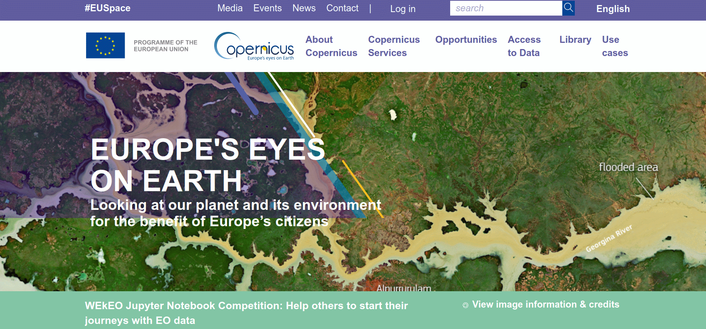
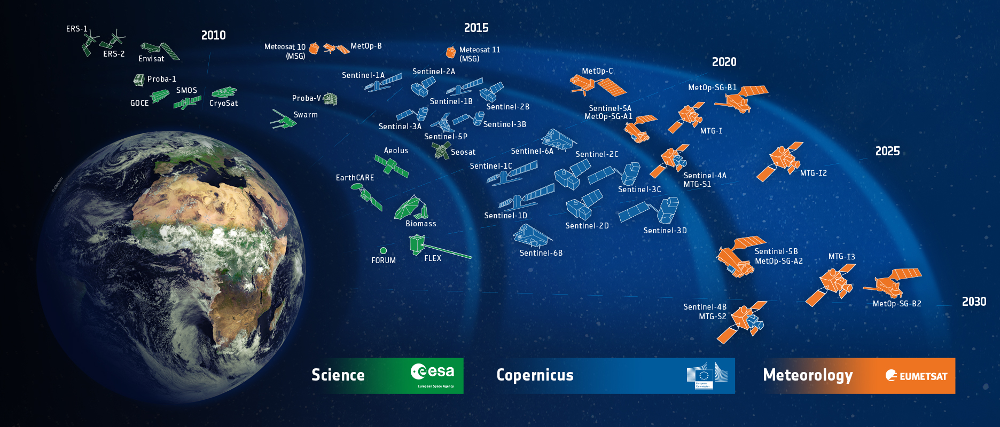
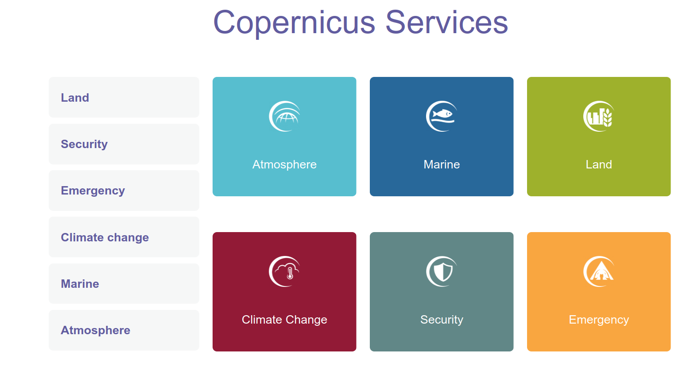
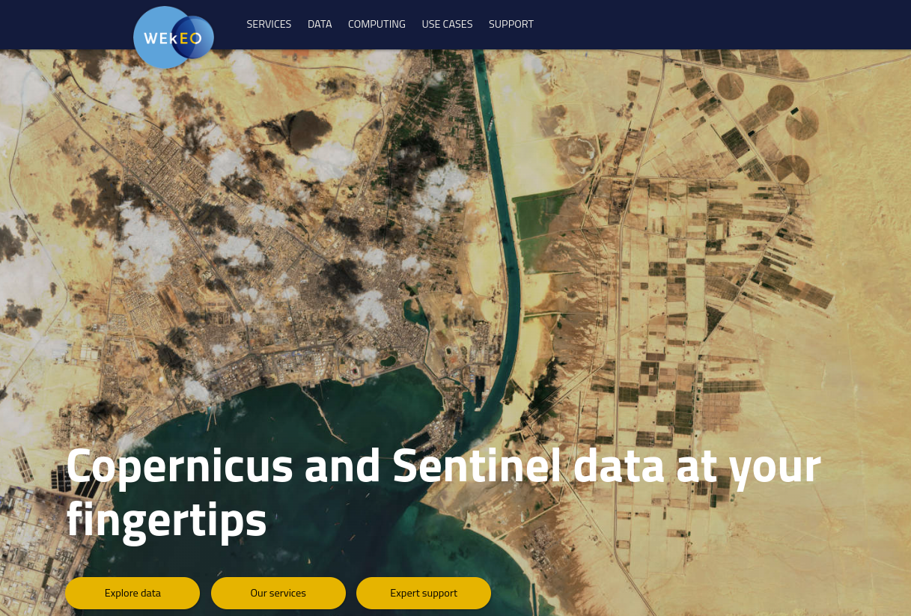
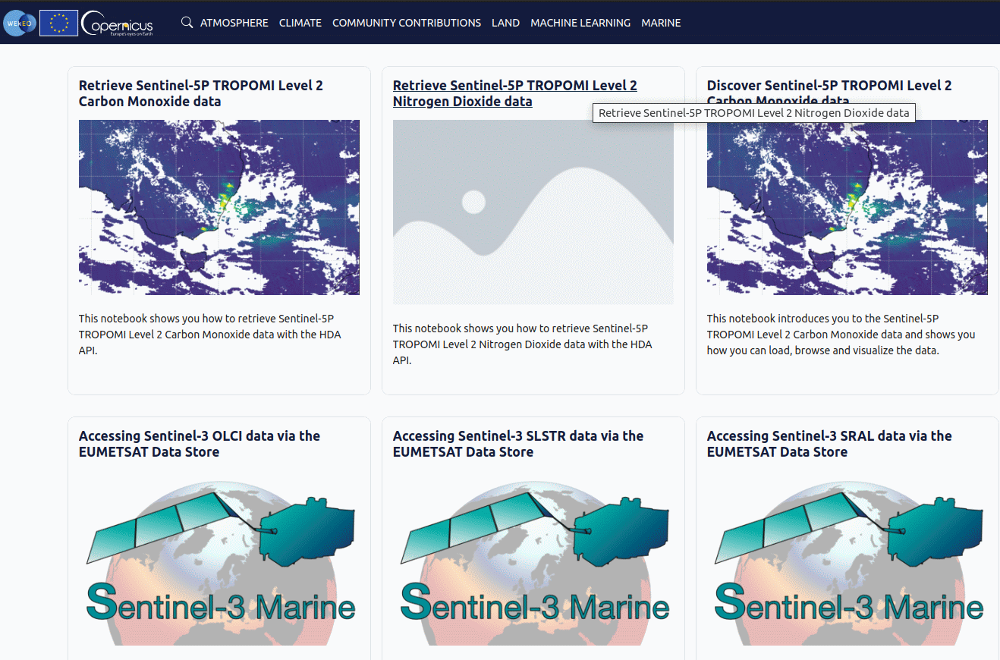
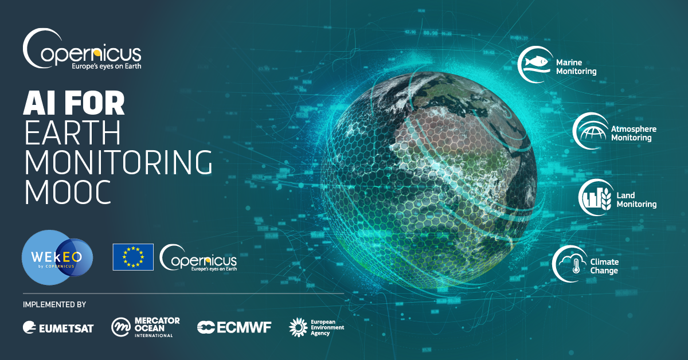

[comment]: # (This presentation was made with markdown-slides)
[comment]: # (This is a CommonMark compliant comment. It will not be included in the presentation.)
[comment]: # (Compile this presentation with the command below)
[comment]: # (mdslides presentation.md --include media)

[comment]: # (Set the theme:)
[comment]: # (THEME = league)
[comment]: # (CODE_THEME = base16/zenburn)
[comment]: # (The list of themes is at https://revealjs.com/themes/)
[comment]: # (The list of code themes is at https://highlightjs.org/)

[comment]: # "You can also use quotes instead of parenthesis"
[comment]: # 'Single quotes work too'
[comment]: # "THEME = white"

[comment]: # (Pass optional settings to reveal.js:)
[comment]: # (controls: true)
[comment]: # (keyboard: true)
[comment]: # (markdown: { smartypants: true })
[comment]: # (hash: false)
[comment]: # (respondToHashChanges: false)
[comment]: # (Other settings are documented at https://revealjs.com/config/)

### The Copernicus program : an open data initiative

<small> Dimitri MARCHAND | junior ML engineer | BeCode Liege | March 16th 2023  </small>

[comment]: # (A comment starting with three or more !!! marks a slide break.)
[comment]: # (!!!)

###### note the url! https://www.copernicus.eu

[comment]: # (!!!)

[comment]: # (!!!)

[comment]: # (!!!)

<iframe width="1120" height="630" src="https://www.youtube.com/embed/MGJss4lDaBo?start=66&end=120" title="YouTube video player" frameborder="0" allow="accelerometer; autoplay; clipboard-write; encrypted-media; gyroscope; picture-in-picture; web-share" allowfullscreen></iframe> 

[comment]: # (!!!data-auto-animate)

### philosophy of copernicus data

- quality earth observation
- open data policy
- community building

Note: This is a speaker note that only the presenter can see.

[comment]: # (!!!)

##### SENTINEL 2
###### multispectral camera for segmentation

[comment]: # (|||)

#### Natural Color (B4, B3, B2)

<small> The natural color band combination uses the red (B4), green (B3), and blue (B2) channels. </small>

[comment]: # (|||)
#### Color Infrared (B8, B4, B3)

<small> In a color infrared image, denser vegetation is red. Urban areas are white. </small>

[comment]: # (|||)
#### Short-Wave Infrared (B12, B8A, B4)

<small> In general, darker shades of green indicate denser vegetation. But brown is indicative of bare soil and built-up areas. </small>

[comment]: # (|||)
#### Agriculture (B11, B8, B2)

<small> The agriculture band combination uses SWIR-1 (B11), near-infrared (B8), and blue (B2). Dense vegetation that appears as dark green. </small>

[comment]: # (|||)
#### Geology (B12, B11, B2)

<small> The geology band combination is a neat application for finding geological features. </small>

[comment]: # (|||)
#### Bathymetric (B4, B3, B1)

<small> Using the coastal aerosol band is good for estimating suspended sediment in the water. </small>

[comment]: # (|||)
#### Vegetation Index (B8-B4)/(B8+B4)

<small> The moisture index is ideal for finding water stress in plants </small>

[comment]: # (!!!)

###### SENTINEL 3: radar waves for terrain deformation 

<iframe width="1280" height="720" src="https://www.youtube.com/embed/SLMWzQQv90s?start=184&end=209"" title="A technique to track Earth’s subtle movements with orbiting radars is heating up" frameborder="0" allow="accelerometer; autoplay; clipboard-write; encrypted-media; gyroscope; picture-in-picture; web-share" allowfullscreen></iframe>

[comment]: # (!!!)
#### data exloration and ML: wekeo.eu

[comment]: # (|||)

#### data exploration tutorials

[comment]: # (|||)
#### best start: futurelearn.com mooc

### 

[comment]: # (||| data-background-color="aquamarine")
#### available projects

- land cover classification
- ships tracking
- marine chlorophyll detection
- methane emission retrieval
- flood extent segmentation

[comment]: # (!!!)
#### thank you for your attention

My profile:
<a href="https://www.linkedin.com/in/dimitri-marchand-978b0721/">
  
  Dimitri Marchand
</a>

<a href="https://www.linkedin.com/in/benjamin-beaumont-42499141/">
  
  Benjamin Beaumont, ISSEP
</a>

